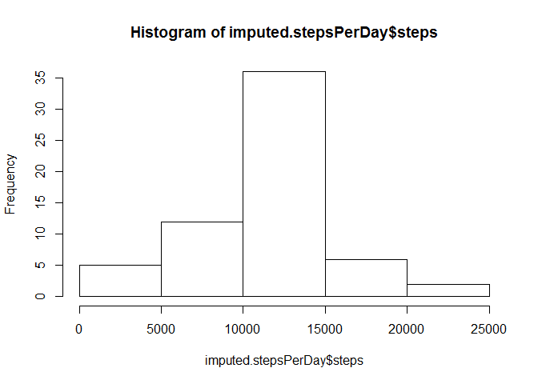

# Reproducible Research: Peer Assessment 1


## Loading and preprocessing the data
*Show any code that is needed to*  
*1. Load the data (i.e. read.csv())*

```r
name.archive <- "activity.zip"
name.file <- "./activity.csv"

if (!file.exists(name.archive)) {
	fileURL <- "https://d396qusza40orc.cloudfront.net/repdata%2Fdata%2Factivity.zip"
	download.file(fileURL, name.archive)
}  
if (!file.exists(name.file)) { 
	unzip(name.archive) 
}

activities <- read.csv(name.file)
```

*2. Process/transform the data (if necessary) into a format suitable for your analysis*

```r
activities$date <- as.Date(activities$date, "%Y-%m-%d")
```


## What is mean total number of steps taken per day?
*For this part of the assignment, you can ignore the missing values in the dataset.*  
The default is to ignore missing values in given variables, therefore it is not mentioned additionally.

*1. Calculate the total number of steps taken per day*

```r
stepsPerDay <- aggregate(steps ~ date, data = activities, sum)
```

*2. If you do not understand the difference between a histogram and a barplot, research the difference between them. Make a histogram of the total number of steps taken each day*  
Good explanation of the difference at  [Forbes](http://www.forbes.com/sites/naomirobbins/2012/01/04/a-histogram-is-not-a-bar-chart/#208e1c2828af).

```r
hist(stepsPerDay$steps)
```

<!-- -->

*3. Calculate and report the mean and median of the total number of steps taken per day*

```r
mean(stepsPerDay$steps)
```

```
## [1] 10766.19
```

```r
median(stepsPerDay$steps)
```

```
## [1] 10765
```


## What is the average daily activity pattern?
*1. Make a time series plot (i.e. type = "l") of the 5-minute interval (x-axis) and the average number of steps taken, averaged across all days (y-axis)*

```r
stepsPerInterval <- aggregate(steps ~ interval, data = activities, mean)
plot(steps ~ interval, data = stepsPerInterval, type="l")
```

<!-- -->

*2. Which 5-minute interval, on average across all the days in the dataset, contains the maximum number of steps?*

```r
nrInterval <- stepsPerInterval[which.max(stepsPerInterval$steps), ]$interval
```
The interval number *835* contains the maximum number of steps averaged across all days.


## Imputing missing values
*Note that there are a number of days/intervals where there are missing values (coded as NA). The presence of missing days may introduce bias into some calculations or summaries of the data.*

*1. Calculate and report the total number of missing values in the dataset (i.e. the total number of rows with NAs)*

```r
sum(is.na(activities$steps))
```

```
## [1] 2304
```

*2. Devise a strategy for filling in all of the missing values in the dataset. The strategy does not need to be sophisticated. For example, you could use the mean/median for that day, or the mean for that 5-minute interval, etc.*  
I would go for the second option, using the mean for that 5-minute interval. As we have seen before, the stepos per interval change quite a lot over a day, whereas usually the average number of steps per day should be more the same. So I think this makes more sense.  
Furthermore the first day has not any single step measured. So using the mean for a day would result in a *NaN* mean for the first day and therefore would not work.

*3. Create a new dataset that is equal to the original dataset but with the missing data filled in.*

```r
activities$stepsAvgPerInt <- ave(activities$steps,
									 activities$interval,
									 FUN = function(x) mean(x, na.rm = TRUE))

imputed.activities <- transform.data.frame(activities,
										  steps = ifelse(
										  	is.na(steps),
										  	stepsAvgPerInt,
										  	steps
										  ))
```

*4. Make a histogram of the total number of steps taken each day and Calculate and report the mean and median total number of steps taken per day. Do these values differ from the estimates from the first part of the assignment? What is the impact of imputing missing data on the estimates of the total daily number of steps?*

```r
imputed.stepsPerDay <- aggregate(steps ~ date, data = imputed.activities, sum)

hist(imputed.stepsPerDay$steps)
```

<!-- -->

```r
mean(imputed.stepsPerDay$steps)
```

```
## [1] 10766.19
```

```r
median(imputed.stepsPerDay$steps)
```

```
## [1] 10766.19
```
The mean is still the same whereas the median differs slightly compared to the first part of the assignment.

## Are there differences in activity patterns between weekdays and weekends?
*For this part the weekdays() function may be of some help here. Use the dataset with the filled-in missing values for this part.*

*1. Create a new factor variable in the dataset with two levels "weekday" and "weekend"" indicating whether a given date is a weekday or weekend day.*

```r
# saving old locale
locale.old <- Sys.getlocale("LC_TIME")
# switch to english so I get english weekdays
Sys.setlocale("LC_TIME","English")
```

```
## [1] "English_United States.1252"
```

```r
# add factor variable
imputed.activities$weekday <- factor(
    ifelse (
        (weekdays(imputed.activities$date) == "Saturday" |
            weekdays(imputed.activities$date) ==  "Sunday"),
        "weekend",
        "weekday")
)

# switch back to old locale
Sys.setlocale("LC_TIME", locale.old)
```

```
## [1] "German_Austria.1252"
```

*2. Make a panel plot containing a time series plot (i.e. type = "l") of the 5-minute interval (x-axis) and the average number of steps taken, averaged across all weekday days or weekend days (y-axis). See the README file in the GitHub repository to see an example of what this plot should look like using simulated data.*

```r
stepsPerInterval.seperate <- aggregate(steps ~ interval + weekday, data = imputed.activities, mean)

library(lattice)
xyplot(steps ~ interval | weekday,
       data = stepsPerInterval.seperate,
       type = "l",
       aspect = 0.5
)
```

<!-- -->
